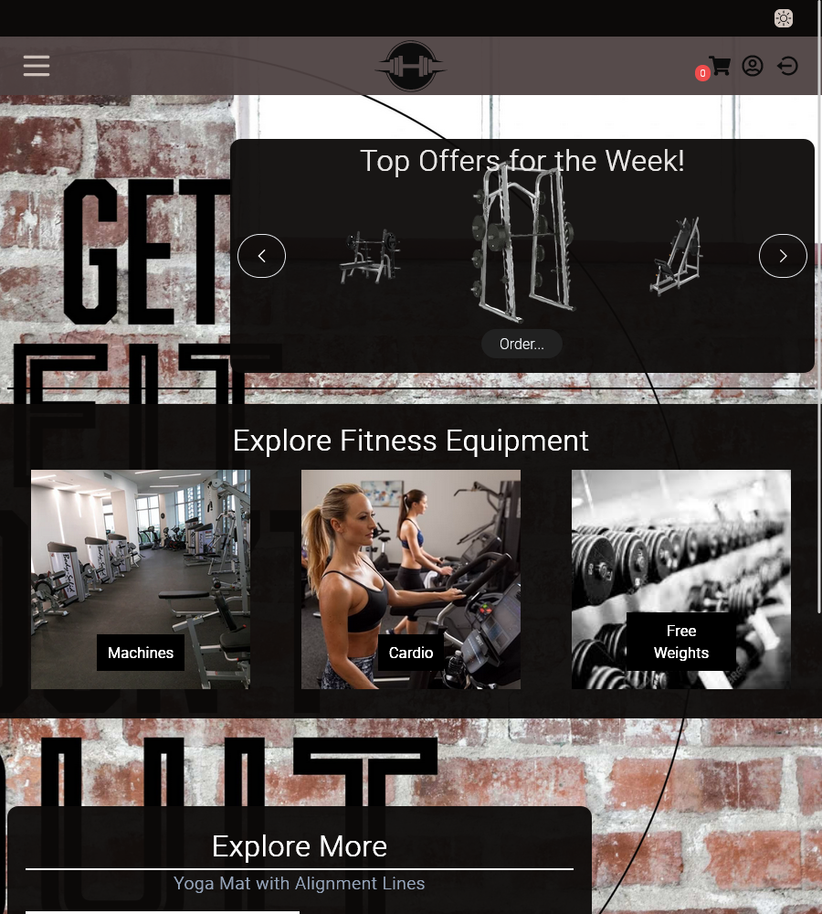
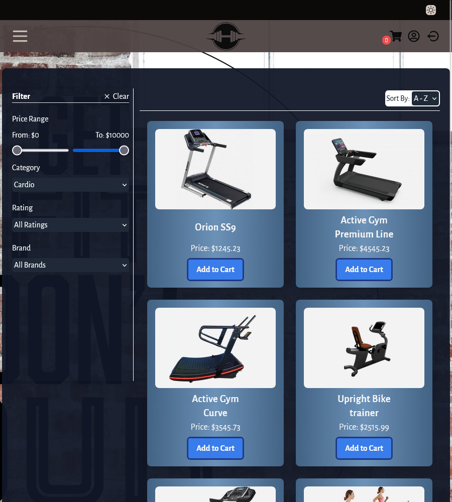
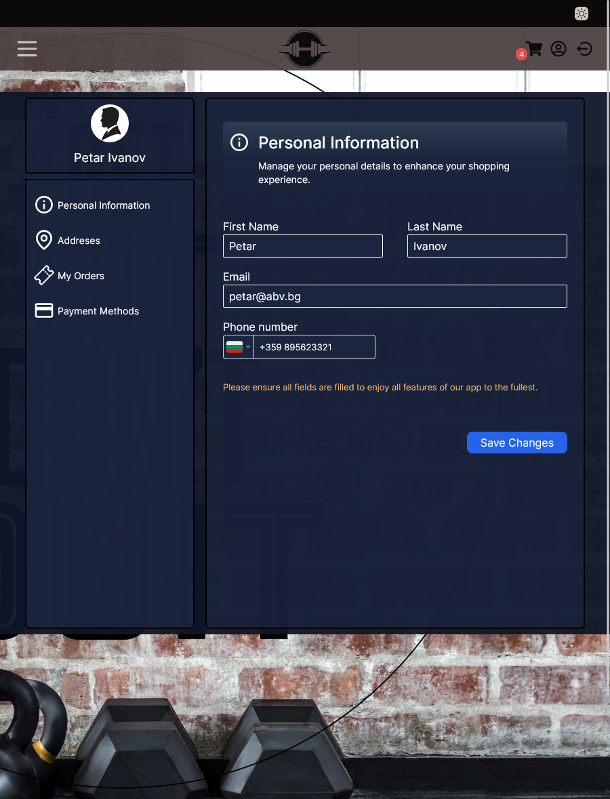
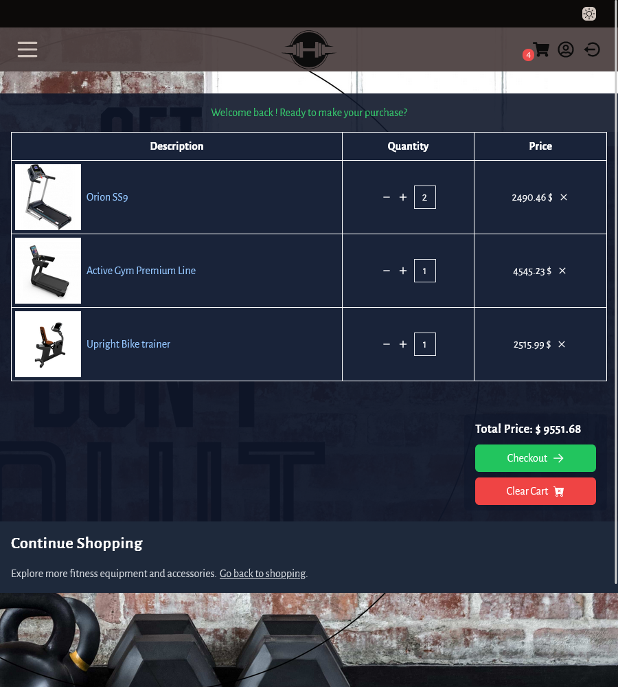

# StrongEqup

Welcome to StrongEqup, a fitness equipment store project aimed at enhancing skills in React and other technologies. This project serves primarily as a learning exercise, providing challenges and opportunities for growth.

## Installation

1. Clone the repository - `git clone https://github.com/PetarIvanov01/Fitness-shop.git`

2. Configure and start the server to utilize all features of the application.
   Server repository: [DrizzleExpress-API](https://github.com/PetarIvanov01/DrizzleExpress-API)

3. Navigate to the project directory and install dependencies via `npm install`

4. Start the application via `npm run dev`

## Features

-   Registration and profile creation.
-   Address management for future orders.
-   Catalog with various equipment categories.
-   Filtering products by price, category, and additional filters.
-   Sorting and pagination functionalities.
-   Shopping cart that retains orders even after exiting the application.
-   User profile options including editing personal information and adding multiple addresses.
-   Planned feature: View order history under "My Orders" section.
-   More features to be added in the future.

## Screenshots

Here are some screenshots showcasing various views of the StrongEqup application:

1. **Home Page**

    

2. **Catalog Page**

    

3. **Profile Page**

    

4. **Cart Page**

    

## Future Plans

In the future, my goal is to deploy the StrongEqup web application so that everyone can access its features. Stay tuned for updates on the deployment progress!

## License

This project is licensed under the [MIT License](LICENSE).
